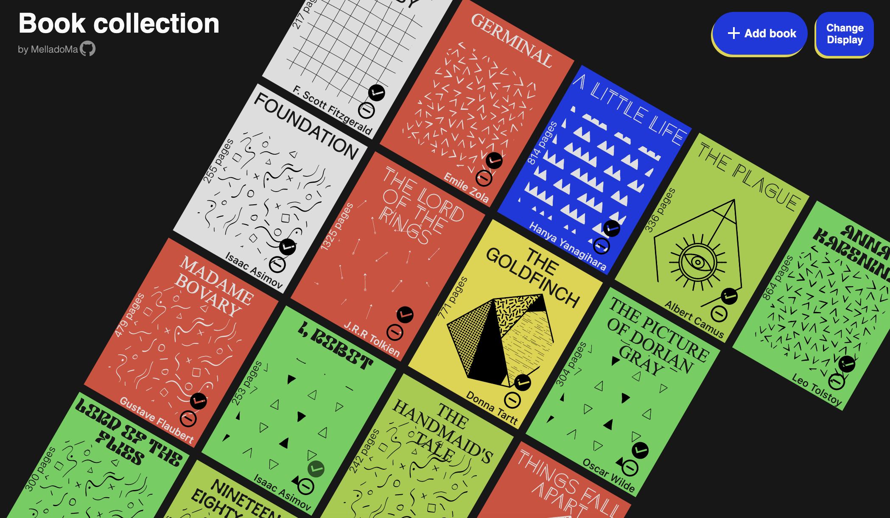

# Library app project

Created as part of **The Odin Project Full Stack Track** - see [project instructions.](https://www.theodinproject.com/lessons/node-path-javascript-library)

The goal of this project was to create a simple JavaScript-only system for tracking books that would allow a user to add books, delete books, and change their read status.

For this project, I challenged myself to try and reproduce a [design image concept](https://dribbble.com/shots/17726062-Chord-Press-Book-Covers/attachments/12888441?mode=media) from [Ariel Jedrzejczak](https://dribbble.com/arieljedrzejczak) with CSS only.

Available displays

Live version can be seen [here].

## added features

- default examples books loading
- local storage handling: books added by user are stored in local storage
- random book cover generation : book covers colors, font and images are generated randomly for each book. Font and image colors are changed to ensure readibility when needed (for blue and red book covers).
- change book collection display : the "original" book display intended was the tilted grid one, closer to original inspiration design.
  However this design proved to be challenging to achieve with CSS only : seemed to me pretty close but not satisfactory enough; so I kept it as an alternative display and developped a leaner grid display for default.
